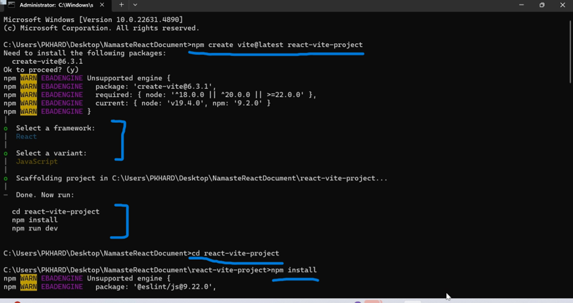

Create-react-app deprecate now , so either we can choose any of the framework like nextjs or use any of the bundlers like vite or parcle we can install react locally.
Vite is a frontend build tool that provides fast development and optimized production builds for web applications.
Vite is not Webpack, but Vite is an alternative to Webpack
https://vite.dev/
create the react project using vite-
1.	npm create vite@latest projectName
Select Framework, select variant 
2.	 cd react-vite-project
3.	  npm install [All the recommended packages install in the folder -install nodejs ]
4.	  npm run dev [Local:   http://localhost:5173/]

🆚 Comparison: Vite vs CRA Folder Structure
Feature	Vite	Create React App (CRA)
Entry File	main.jsx (inside src/)	index.js (inside src/)
Main HTML File	index.html (root)	public/index.html
Build Tool	Vite (ESM + Rollup)	Webpack
Static Assets	public/ and src/assets/	public/
Config File	vite.config.js	webpack.config.js (hidden in CRA)
Faster HMR	✅ Yes	❌ No (Slower)

Difference between package.json & package-lock.json-
=======================================================

package.json-
----------------
Main purpose of package.json is to define project dependencies, name and version and it also contain scripts and metadata, It keeps the approx. version and it is editable by developers, editable minor version and major version. minor versions represent by * Caret sign (^) and major version is represent by Tilde sign (~)

package-lock.json-
---------------------
keeps the exact version of dependencies ensuring that whatever version is installed on my development machine is the same version used in the productions, locking the dependency version so that same version are used in both development and production, it is auto generated when we running npm installed should not be manually editable. 
"Imagine you’re working on a React project. You install react@18.2.0, and your teammate installs react@18.3.0 because of flexible versioning (^18.2.0). Now, your code works fine, but your teammate faces unexpected bugs due to breaking changes in the new version. This inconsistency can cause major issues in production."
✅ Solution: package.json defines the required dependencies, while package-lock.json ensures everyone installs the exact same versions, preventing version mismatches and unexpected bugs. 🚀

Npm and Npx- 
-------------
npm  - (Node Package Manager) installs packages globally or locally
npx - (Node Package eXecute) Runs packages without installing them globally

Bundlers
----------
bundlers are tools used to combine multiple files (such as JavaScript, CSS, and images) from a project so that it can be shipped to production.
Examples: 1. Webpack 2. vite 3. Parcel

What is the dist Folder?
---------------------------
The dist (short for distribution) folder contains the compiled and optimized version of your application, that are ready for deployment.

JSX
-----
JSX (JavaScript XML) is a syntax extension for JavaScript that allows us to write HTML-like code inside JavaScript 
JSX makes React easier to read, write, and maintain while improving performance and preventing security risks.

Babel
-------
Babel is a JavaScript compiler that takes JSX and transforms it into plain JavaScript that browsers can understand. Since JavaScript engines only interpret ECMAScript (pure JavaScript), Babel ensures JSX and modern JavaScript features are converted for compatibility.

