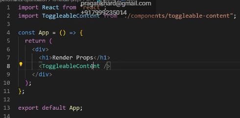
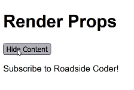
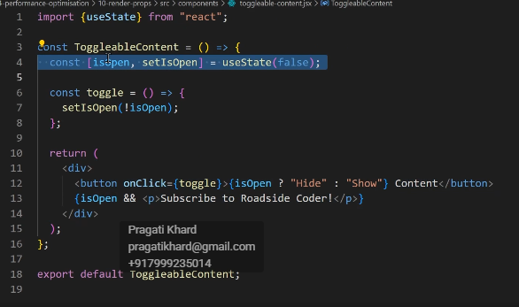
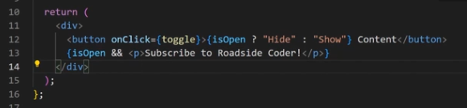
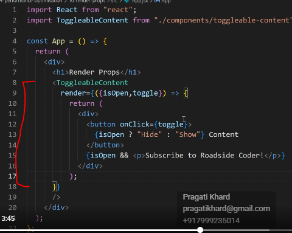
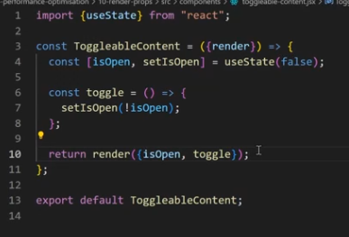
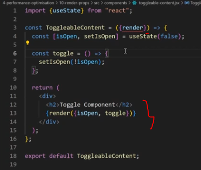

render props is a pattern are designed pattern in react where a component's logic is encapsulated in a prop that the component calls to render is output. So like that's a lot of theory, right? So let me explain in simple words. So, basically, we have this component over here, toggle label component, right? And if I show you the final app first, if I click on it, they simply just shows a message over here, right? Shows or hides, the message. 

And inside of this component, we have this div with the state over here isOpen and whenever we click 

we click on this button, it either hides or shows this particular message with respect to this is open pin. Okay. Now, imagine a scenario where we had to reuse this component again and again.

This logic to remain the same but this thing to change, right? Or probably we can have something else as well over here, but certain certain part of this prop to change, So that is where render props comes into the picture. You can consider it more of, you know, code reusability, and it makes our code more flexible. 

 So let me show you What we have to do, we have to basically pass a component through a prop. So let's say, we'll take a render over here or a prop that is called render. And inside of it, we will create a new component. So component is basically a function in the end, right? And we will receive these two things is open and the toggle function. These two are the things that are required to make this component work, right? So let's say, is open and toggle, Whole code and paste return and paste it right over here over here. Function as well right here. Render. It take this render over here and I'll just send them as open and the toggle, right? And let's see if this is working fine or not. And trust me this way of, you know, writing code is used in a lot of big tech companies. 

 

 

I think we're supposed to send it in an Object format.
Yeah yeah this is working but see the actual use case of this comes when you actually have to you know add some more Functionality or you know, let's say you have to build some other Ul over here as well.
Let's say, if I'll just wrap it inside of a div Script curly braces. 2, which will say toggle component. Now, this is same, but this is going to be different for different different types of component, right? So, this is what a render problem is all about

And let me give you another example. Like, for example, you can see in Amazon, we have the product card, right? So let me open Amazon. So let's say we have a lot of product cards now, suppose this section or probably whatever, like this, this section is supposed to be dynamic, right? So what we can do, we can create a render prop for this particular card component and we can supply this thing from outside. So this

this thing will be dynamic. You can consider it kind of similar to higher order component as well. But not component and we can supply this thing from outside. So this thing will be dynamic, you can consider it kind of similar to higher order component as well. But not really because higher order component supplies with different efforts and stuff as well even though this also supplies us with props, but this is used more of so make sure that you have implemented this somewhere in your apps as well. This will put i will put a really good impression on the interviewer.

