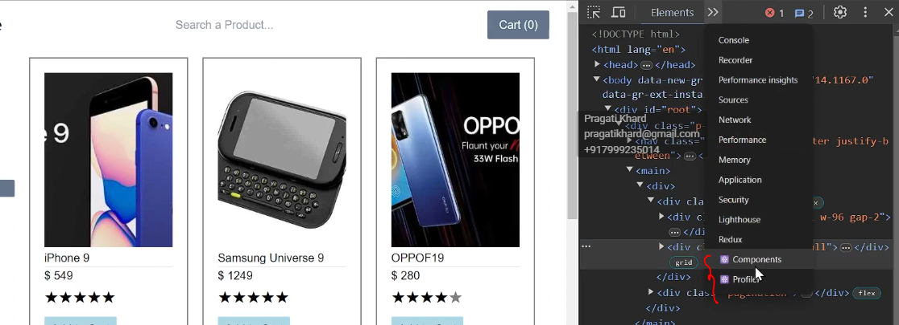

React profiler
---------------

React profiler it bascially a part of react developer tool/ react devps tool

How do you install it - 

https://react.dev/learn/react-developer-tools

https://chromewebstore.google.com/detail/react-developer-tools/fmkadmapgofadopljbjfkapdkoienihi?hl=en

----------------------------------------------------------------------------------------------------------

What basically does is - 
---------------------------
Inspect - > We get these two extra options overe there -> Components and profiler

We need to understand why do we need this component & profiler ?
we already have elements tab which shows all the dives and everthing. This is with respect to like transpiled data. This is converted data/JSX into normal HTML. If you want to see the JSX we can not see over there

Component -
------------

* If we go to the component section you're going to see it show us the exact level by level JSX of our app and all the tags that are included with all the details like its state and hooks, routing etc. It bascically provides us the complete information.

We have these icons over here - 

-------------------------------

1. 

First icon is Focus the selected component into an errored state. If i click on it you're gonna see our app which throws an error. Maybe this can be used for testing our erros like errow boundary.

2.

Second one is inspect the matching DOM element . Inspect the matching DOM element and If i want to see, where the element does exist inside the DOM. So, what i can do , I just click on the eye button and it will just take me directly to the div. 

3.

Log this component data to the console. If we want to see the further state, props. We can see there

4.

View source for this element. It will onto this source(src) tab and you can see where this is inside of our code.

Profiler -
-----------

Profiler is used for measuring the performance. It provide us the chart , this chart provides us how much time a particular component took to be rendered

If i click on this start profiling make the changes(ex. change the star rating)

It will provide the rank chart. This cart shows us how much time a particular component took to be rendered and we have the different different components a, different different times like - here we can see the render time in Rendered at section, here we can see home component re-renderd 2 times and star section takes 47.3 ms time

 And If i come over here in he flame grap chart, you can see the sequentially show us what are all things that got rendered or not rendered.

 

Components in blue indicate they were re-rendered.
Components in grey indicate they did not re-render.
Home page component took 945 milisecond out of 1400 miliseconds. So, what does this means? so this basically means that it the home page only took 943 miliseconds and star and filter component inside of it takes this much time.
We just remove the loops logic and start and stop the profiler. So we have largely optimized our app and made it so much faster.

If the component is re-render , you can see what caused this update. It will tell us exectly why this was re-rendered. 
So if yo go to the settings, over here and in the profiler, just tick record by each component rendered by profiler. and it will show you what caused this updated.

Now we have one more thing we have timeline of re-rendering. 

React developer tool is all about , this is how it helps us to you know, showcase our app, showcase the states and hooks that we're usig inside of our app, potentially improve the performanace of our apps. Going inside of the profiler and finding out the culprits which are responsible for slow , rendering of the components or of our app as a whole.

-------------------------------------------------------------------------------------------------------

There are multiple techniques in React that we can use to optimize our application, we do have react profile  which is part of the React Developer Tools extension.

Once we install the React Developer Tools, we get two additional tabs in the browser dev tools: Components and Profiler.

When we inspect we already have elements tab which shows all the dives and everthing. This is basically converted data/JSX into normal HTML. If you want to see the JSX we can not see over there
by using component section you can see it the exact level of JSX hierarchy of our entire application and all the tags. also It shows each component’s props, state, and hooks. This makes debugging much easier by allowing us to trace where each component exists and how it behaves in the DOM.

Profiler is used for measuring the performance. The Profiler tab provides a performance rank chart that shows how much time each component took to render or re-render. This visual representation helps us identify performance bottlenecks and optimize components accordingly.
There is also the option of flame grap chart, there you can see the sequentially show us what are all things that got rendered or not rendered.

Components in blue indicate they were re-rendered.
Components in grey indicate they did not re-render.

Together, these tools help us inspect, debug, and optimize our React application more effectively.

