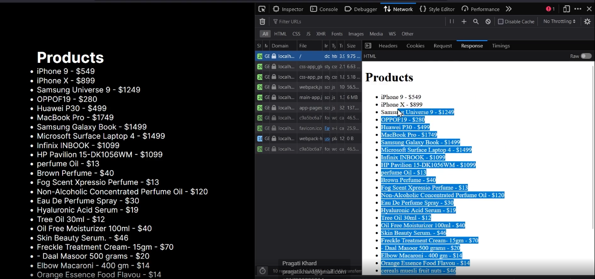
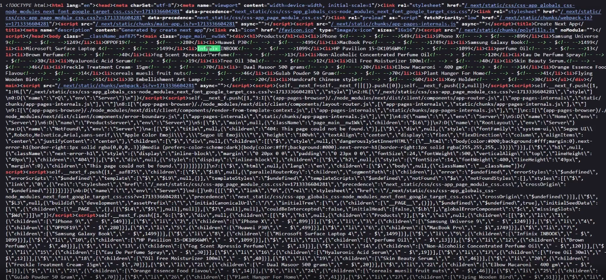

Client side Rendering vs Server Side Rendering
------------------------------------------------

* Server is the part of our backend and client is more of what we see in front of it.
* Client side rendering means an app which is compeletely being rendered on the browser.
* React allows us to create client rendered appliction.
* We can take the example of fetching the data from the API's
* But what is client render means - right click and go to the view page source. All the data coming from API display on the browser but we can not see in the view page source / in the HTML document. We just have the div ID root.
* All the data rendered in the element tab is not useful for us because Google is not able to crawl this data and hence website won't be ranked on Google search results because you know if lets see if we are showcasing iPhone9 or lets say Samsung universe 9 device in our website. If someone searches this on Google, they won't be able to find that product exists on our website because Google search engines can not crawl it . This is an example of a client rendered application.

Client side Rendering Props & Cons-
------------------------------------
Props - 
* Rich interaction - 
In client side rendering we have the rich interaction. we are using something like react-router, whenever we click on any other link so yu can see the website chnages instantly. Client rendered app give us the feeling of you know basically a nativeness to that app. 
like for example when we use an app inside of our mobile phone everthing is just instant.

* Reduced server load -
Most of the rendering done on the client side, it reduces the load on the server. 
If we go to the network and just see the JS file that we're getting inside it we can see the chunk og javascript coming from backend. so that a huge js file whch is resposible for injecting the code inside of this dev with ID root . So most of the rendering is happening in the frontend which result in reduced server load.

* Better client-side caching -
If we have any assets lets say images , if we sent any websites and has a bunch of images, first time it will takes a lot of time but when you refresh the page next time the image load instantly. That's why it is better for client side caching. But evertime if its coming from the server, we have , to load those images again and again.

Cons-
* Server initial load - Since we have huge chunk of JS data from backend. Imagine we have bigger react application lets say ecommerce site. what's gonna happen there, our website take quite a lot of while to load and yeah we wil discuss a lot of otimization techniques as we move forward. Ecommerce web server or something like that. If you're completely making it client rendered, then definitely it will be slower in initial load.

* Bad for SEO - Since we don't get anything inside of our page source, we're just getting an empty HTML. So, its not at all good for SEO
* Dependency on the user's device - There is a dependency on the user's device because every single function is happening. Every single functionality, is taking place on the user's device and it's dependent on the browser's capability.

So the solution for this server side rendering.

Server Side Rendering-
-------------------------
When comes to the server side rendering a lot of us thinki that we are gonna use next.js but before next how do the people setup server side rendering

https://react.dev/reference/react-dom/server

so we have this react-dom/server these help us you to render our whole application to our server and for this we have to setup node.js. 
Also we have these functions - 
renderToPipeableStream , renderToReadableStream its the huge topic and now a days there is much better solution for server side rendering a framework.
Next.js, Expo

https://react.dev/learn/creating-a-react-app#production-grade-react-frameworks

https://nextjs.org/docs/app/getting-started/installation

After setting up the nextjs we will get the multiple files in the network  and see we have this HTML file and see this proves that this app is now server rendered beacuse now we are getting the whole HTML pge from server. So server has done the heavy lifting and provided us with this page over here.

Now in the source code we will get the all the fetch data overe here and this is what about server side rendering all about 

Props -
* Faster initial page load - Because we are not getting the huge chunks of jvascript. So, in a react tab, if there was a multiple page application, we would get the data for a of these pages at once, but in this we will only get the data for all of these pages at once, but in this, we will only get the data for the data for all the current page.

* Better SEO - Obviously because google can crawl. now our website and display ,you know, the data accordingly to the people who are searching for that product.  

* Consistent performance - No depends on the user's device for the rendering capabilities.

Cons -
* Increased lod of server - Increased load now server had the increased load so your server costs can go up.
* Frequent server requests can increase latency - If you are using something like caching and all it can increase you latency.
* More complex to implement - I mean this is not that much accurate because earlier it was complex to implement when next did't exist, but right now , its much more easier, But again there are a lot of corner cases that occur when you something like server side rendering.

Use cases- 
------------
Client-Side - Ideal for application that require rich interations after initial load. such as single-page application where SEO is not a primary concern.

Server-Side - Best for content-heavy sites where SEO and fast initial load times are crucial, such as ecommerce sites and news websites.

makes these both of these things to create an ideal application and this is best for content.

