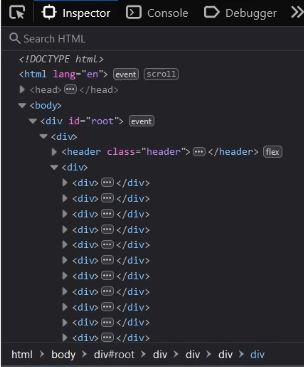
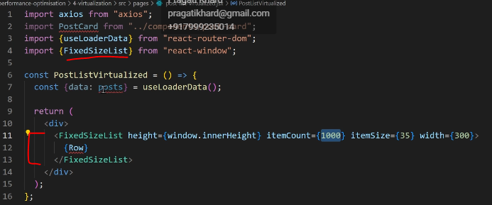
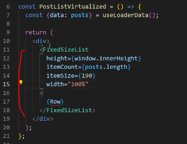
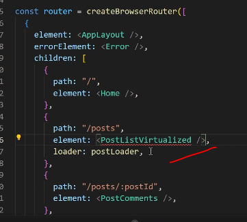
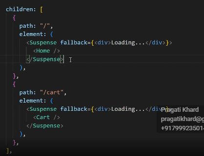
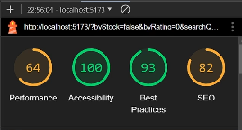

React application consists of bunch of methods components and third-party libraries. And if we didn't do anything to make those different parts load only when they are needed, a huge bundle or chunk of JavaScript will be shipped to your users as soon as they open your website, which will affect the performance of your app. Significantly. 

For example, we have this shopping cart app that we made earlier in the machine coding session, right? If we load this app, you're gonna see if I go to inspect and spectan in the network. Let's just select JavaScript and load this page. You can see right over here. We have this huge chunk of javaScript that is being loaded every single time. You can see 925 kilobytes all at once. So this chunk of javaScript contains the data inside for this page, like, JavaScript for this page, and JavaScript for this page, as well. Right. So, what should we do to avoid this? Yep, the answer is code splitting.

Bundling -
Most React apps will have their files “bundled” using tools like Webpack, Rollup or Browserify. Bundling is the process of following imported files and merging them into a single file: a “bundle”. This bundle can then be included on a webpage to load an entire app at once.

so the chunk of javascript over here in the network tab, this is basically achieved using webpack, webpack efficiently, takes your code and bundles it into one single file and all of the things. Like, for example, if you have installed an independency, it's gonna use that in here and things like this. But this doesn't always guarantee the optimization of performance. So we use something called lazed lazy loading, which is the part of this code splitting process. Let's understand this. But first of all, what I'll do I'll measure the performance of our app.

Let's open Chrome. So I'll just copy this and inside of the Chrome, if I click on inspect, we have something called Lighthouse over here. where we can see the performance 

So what we cn do to improve the performance - will use the lazy loading technique 

Import the component using lazy -

we use the lazy function and inside of it using callback and there we will import the component 

What will be displayed when this star rating is being loaded. So that we need to wrap the component inside suspense and suspense takes a fallback

You may have seen for a split second there was star component after that start component is loaded

Same thing we can do in the paginantion 

There's going to be different usecases according to which you have to implement this feature.

we can implement the lazy loding in routes. when we load the page particullarly on that page.

 so you might be thinking, why are we not wrapping this suspense in over here like you know, in a whole of our app. So the reason for that is Let's see if any error occurs in this home component. The error boundary is over here, right? so we won't have this protection.so we re wrapping it a of our seperate component.

 

Lighthouse and let's generate a new report so analyze page load. So there you go. We have improved performanceby I think eight points. So earlier it for 56 right now, it's 64. So you see this is the power of code splitting. And again it's not just code splitting that will significantly boost the performance of our ad. Obviously they are other things as well, which you can see FCP Icp CLS which we will be discussing in the coming lessons in probably our web vitals lesson

