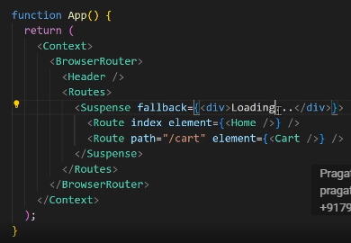
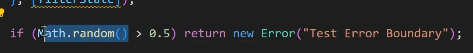
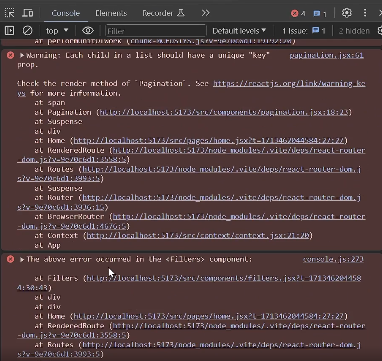
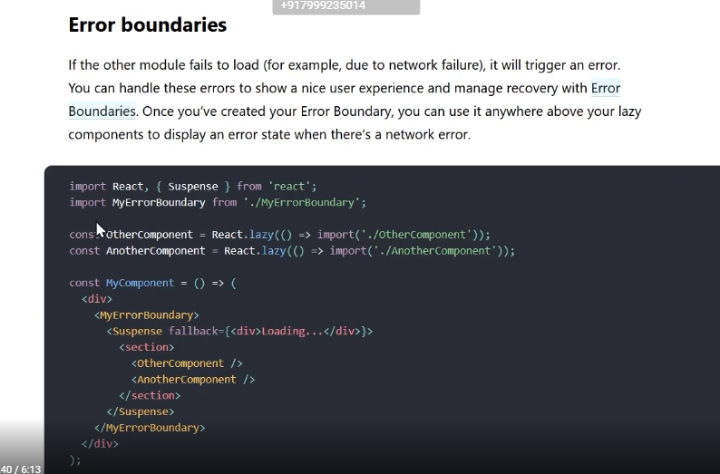
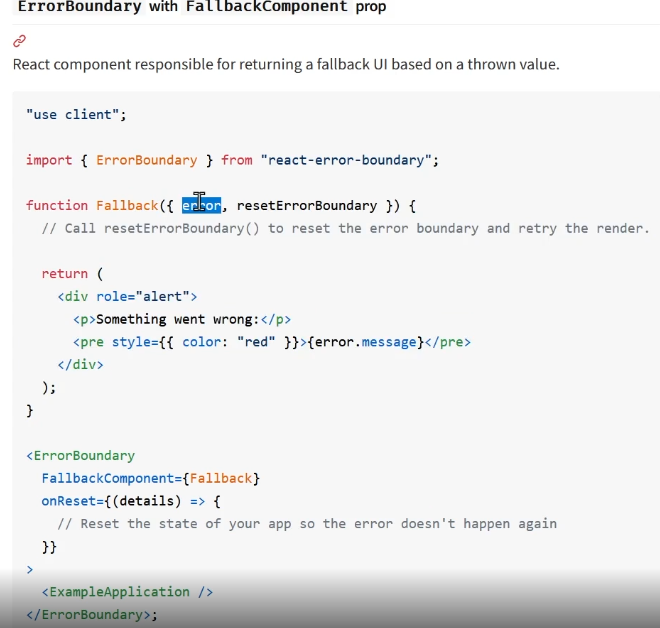
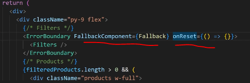
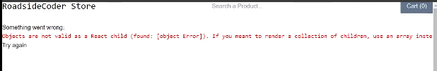

Previous lesson. We saw how we can implement code splitting right and in our modern react router, Dom implementation. I mean, modern reactor, 6.4 and above. We have the option of **errorElement** which basically handles the error of our app for us, right? But earlier Comment this out. And if we have something like this, the previous approach of writing, react, router, Dom, let's import header, all the routes and that's all I guess

And then we would just wrap whole of our With this suspense, and this suspense will take a fallback, which will and then wrapped this whole app in this context & routes. Okay, I think now it's working fine. 

let's try to simulate an error in any of these components. And, In the earlier version of react Auto, we didn't have the option to, you know, add something like an  **errorElement** to handle these errors. So, so that's when we need to, we need to implement the error boundary.

simulate some error. 

whenever this filter component is loaded, I'll add this condition over here, if math.andm is more than. So basically this will generate our random number between 0 and 1. If it's more than 0.5, then we will, you know, simulate an error. So let's see if I refresh this. Yeah, you can see. Our app is breaking now.

So how do we efficiently catch the error and display some message in the place of it.

if I go back to my documentation of code splitting, if we scroll down further, We have something called error boundaries, so you can see over here, they have created this compound called my error boundary and they are wrapping whole of our app inside of this error, boundary component.

If any of the module fails to load load, put like, for example, you do Network failure, it will trigger an error. And this error can be handled by error boundary and the best way to handle these errors. Is using something like react. Error boundary. And this is a very use, very useful Library. 

https://www.npmjs.com/package/react-error-boundary

So let's just go and install it.

npm install react-error-boundary

How we can implement it -

Create the component error.fallback.jsx

So now what we just need to do, we can go back to app.jsx. And we can wrap whole of our app in the error boundary or if you want you can wrap a specific part of that app in the error boundary. So if I go to Homepage. Yeah, this is the home page. Boundary. Let's import this error boundary first. Import error. Error, boundary from React and a boundary, and it's actually named import. So okay. Now, this error boundary takes a fallback component takes two things - fallback and reset function

this is basically might be using the older version of react router.