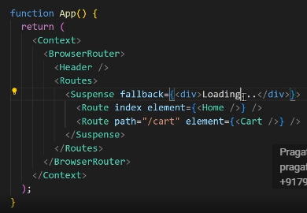
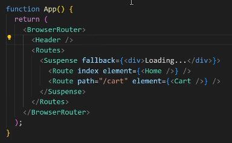
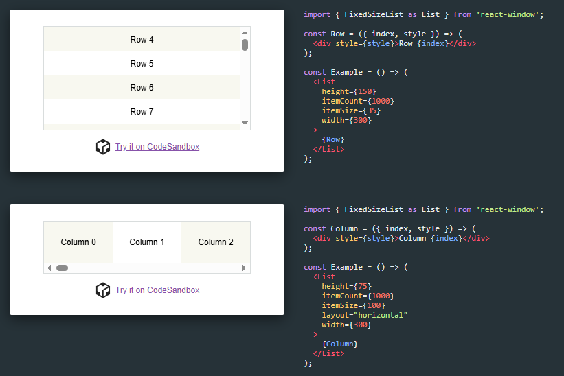
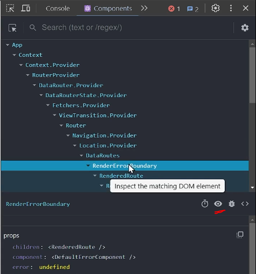

So there's a very popular interview question which is very frequently asked from the senior developers is that suppose your given a very long list of data, for example, 1 million items to be rendered in your app. So how will you effectively render it without compromising the performance? 

So over here you can see we have this long list of data, right? If I inspect it, you can see And all of this data is rendered at once. Now, imagine if this data was, I don't know, something like 10, 000 items, or 100, 000 or even one million items. How will you render it, effectively? Now, some of you might say, yeah, we will just implement the pagination that we saw in the machine coding section. Yep, that's right. Or we will implement the infinite scrolling, but I'll tell you the new tactic that a lot of companies use these days. A lot of big tech companies use these days is virtualization and this is what the interviewer always wants to hear from you.

I mean, you can explain them that you're going to be using Infinite scrolling by using throttling Etc. Right? But if there's so much of the data that has to be rendered in the front end, like we have the detaine the front end, we have to render it in in a browser. Our GPU might get slowed. Right? So to render something like this, we have to use a technique called virtualization. Now, what the hell is virtualization? Let's search Google So virtualization react okay. So if I go to images, this right, this right here. Yeah, this is a good representation of virtualization.

It has the data that has been rendered, just like this on our page, but after virtualizing this list, This is how it will look like. So this is our Dom and this is the data that is visible and it will only render the data that is visible on our screen and will not render the data that is not visible. But as soon as we start scrolling, it will render this data as well. So let's let's let me give you an a much better example. So there's a library called react window.

https://react-window.vercel.app/#/examples/list/fixed-size

https://developer.mozilla.org/en-US/docs/Web/API/Intersection_Observer_API

much effectively, instead of, you know, just going on and Course implementing it on our own. I mean you can implement it on your own by using this, enter section, Observer API from JavaScript, this is inbuilt JavaScript API for detecting viewport items, but implementing something like, this, could be very hard, right? So, this is the industry standard that. We generally use react window for virtualization.

And also, if you don't remember, I already discussed about this intersection Observer in my custom hook section of this course, so you can go and check it out. Okay, well, it's not worry about it, so let's see. 

We have this data over here, right? And if we scroll down, we have a lot of data. We scroll down any further here, you can see we have 9.99 items so this is a lot for performance, right? But let me show you something. If I inspect this div and Data. Let me just. Yeah, you saw there was 999 items, right? 
But here we can see one, two, three, four, five, six, seven items, only, right? Four items. Those are visible and three items that those are hidden. But as soon as we start scrolling notice, as soon as 0 and 1, went out of our viewport, those were removed from the Dom. And as soon as we came down, new items were added, let me show you. As soon as I scroll, it notice.. New items are constantly being added to the Dom. And the older items are being are removed. And this is the technique of virtualization. 

We are not changing the size of the Dom. We are not putting unnecessary items on our Dom tree. We are removing them as soon as we are done with them and we are adding the new items. So let's see how we can implement this. So if you go back As I showed you, we have already have this list, right? Let's virtualize this list. So, we have this Where is it post list component, right? With post loader and all we, I already showed you how you can, you know, build it in our reactor Dom section. So I'm just gonna duplicate it over here and let's just call it post list. Through realized. All right, let's just change the name of this component as well post list. Where it's realized if you want, you can change it. It's not really necessary. Okay, so everything is just fine over here, but there are few changes that needs to be made. If I go back to the documentation, we can see they are rendering this row over here. And

I guess they don't really have any data list rendering it directly, but for us. Luckily, we have the data in this posts, right? So what we need to do, We need to render something called list from react window. So let's just take this, and let's import it over here. Red, leverages gonna call it. Flat fixed size list, only, and also, one more thing, this has multiple different size of lists. As you can see, it's horizontal variables scrolling indicator, multiple different sides of lists, right?

But we not going to worry about those because those are not generally asked in the interview, this is the only thing that you need to, you know, prepare for your frontend interviews. So okay, let's see how we can use this fixed size list. So let's just remove this for now. And if I go back to the documentation, we can see we have this list component, okay, I'll just copy and paste it over here, then we will see how we can, you know, use it. Let's just replace this list with fixed size list.

I want the height of our complete list to be whatever. It wants it to be, right? I'm not gonna provide it a fixed height. So I'm just gonna say window dot in our height so that it can expand it to its full potential. Then item count, how many items are there? How many items are there, right? So I can just say posts. Like for example, in this case, they have given item sizes, 35 pixel. So either we can do that. So in our case, I think I Put the size for each of our posts to be somewhere around 150, I guess. Okay, so let's just do one thing. Let's just give this 190 pixels. Just two have extra space with us and width. So width, they have given it fixed width, I'll just give it 100. So Now, instead of it, we're going to render each and every item. So, So they have given it index and some style so that this can pass whatever style that this want to that particular. Inside of it, I'll just render my postcard so post. Have, you know, map we're not doing maps. So we don't have the access of each each and every post element. So how do we get that? We can take this posts and but we have this index, right? That they are providing. So I can take index X dot ID, and For each and every post that we're supposed to provide it, I guess this should be pretty much it. Let's call this. Instead of this row I'll call it post and I'll just render this post right over here. Okay you see how easy it was to implement something like this? But let's go in and see if it's working. 

Fresher odd app. Let's go to oh sorry my bad. We haven't replaced this in our app, on our app.jsx. I'll say post list virtualized. My comment or let me just remove this all together. Okay, cool. Let's go and see if we are on our Dom so we have all of these Dev elements. Okay. Great. This is just showing a selective developments and as soon as we scroll you can see it's removing the older ones and it's adding the newer ones. Amazing, this is working flawlessly. So you see how easy it was to implement something like virtualization and see Even if I'm scrolling so fast it's adding it instantly in our Dom. And just render it and you can Implement it by using react window. Just like I have done over here and I would highly recommend you to go and add this optimization in your personal projects as well. Because this trust me creates a very good impression. The interfer will think that. Okay