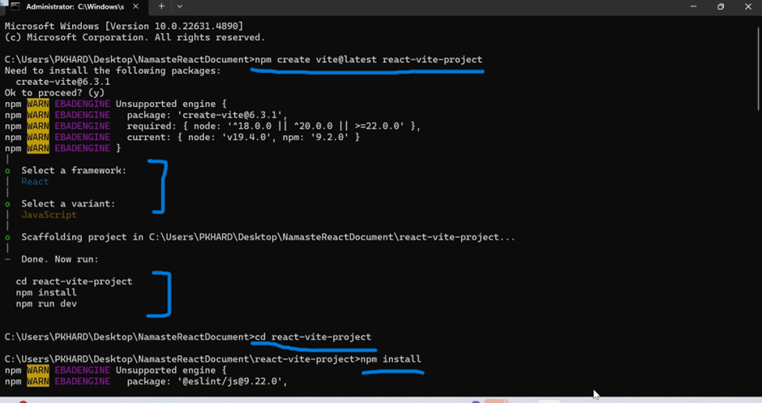

Create-react-app deprecate now , so either we can choose any of the framework like nextjs or use any of the bundlers like vite or parcle we can install react locally.
Vite is a frontend build tool that provides fast development and optimized production builds for web applications.
Vite is not Webpack, but Vite is an alternative to Webpack
https://vite.dev/
create the react project using vite-
1.	npm create vite@latest projectName
Select Framework, select variant 
2.	 cd react-vite-project
3.	  npm install [All the recommended packages install in the folder -install nodejs ]
4.	  npm run dev [Local:   http://localhost:5173/]

Difference between package.json & package-lock.json-
=======================================================

package.json-
----------------
Main purpose of package.json is to define project dependencies, name and version and it also contain scripts and metadata, It keeps the approx. version and it is editable by developers, editable minor version and major version. minor versions represent by * Caret sign (^) and major version is represent by Tilde sign (~)

package-lock.json-
---------------------
keeps the exact version of dependencies ensuring that whatever version is installed on my development machine is the same version used in the productions, locking the dependency version so that same version are used in both development and production, it is auto generated when we running npm installed should not be manually editable. 
"Imagine you’re working on a React project. You install react@18.2.0, and your teammate installs react@18.3.0 because of flexible versioning (^18.2.0). Now, your code works fine, but your teammate faces unexpected bugs due to breaking changes in the new version. This inconsistency can cause major issues in production."
✅ Solution: package.json defines the required dependencies, while package-lock.json ensures everyone installs the exact same versions, preventing version mismatches and unexpected bugs. 🚀

Npm and Npx- 
-------------
npm  - (Node Package Manager) installs packages globally or locally
npx - (Node Package eXecute) Runs packages without installing them globally

Normal Dependencies (dependencies) -Needed for the app to run in production
Dev Dependencies (devDependencies) - Only required for development/testing

Bundlers
----------
bundlers are tools used to combine multiple files (such as JavaScript, CSS, and images) from a project so that it can be shipped to production.
Examples: 1. Webpack 2. vite 3. Parcel

What is the dist Folder?
---------------------------
The dist (short for distribution) folder contains the compiled and optimized version of your application, that are ready for deployment.

JSX
-----
JSX (JavaScript XML) is a syntax extension for JavaScript that allows us to write HTML-like code inside JavaScript 
JSX makes React easier to read, write, and maintain while improving performance and preventing security risks.

Babel
-------
Babel is a JavaScript compiler that takes JSX and transforms it into plain JavaScript that browsers can understand. Since JavaScript engines only interpret ECMAScript (pure JavaScript), Babel ensures JSX and modern JavaScript features are converted for compatibility.

Why might code work locally but fail in production?
-------------------------------------------------------
several factors can cause failures in production due to differences in environment, dependencies, and configurations.

Which components are better: class or functional?
----------------------------------------------------

Functional components are generally considered better than class components in modern React development. This is mainly because functional components allow you to write cleaner and more readable code, especially with the introduction of Hooks.

Hooks like useEffect let you handle side effects in a much simpler way. Instead of splitting logic across multiple lifecycle methods like componentDidMount, componentDidUpdate, and componentWillUnmount in class components, you can now combine all related logic into a single useEffect hook. This makes the code easier to manage and understand.

Additionally, functional components are lighter and more concise, which improves readability and performance. As a result, they have become the preferred choice in the React community.

Conditional rendering 
-----------------------
rendering based on condition is known as conditional rendering. Example – simmer effect
It is like we load fake page until the actual data from API

Optional chaining-
-----------------------
Optional chaining is a feature in JavaScript that allows you to safely access nested properties of an object or array, returning undefined instead of throwing an error if the property doesn't exist or is null/undefined.

Frame it 
-----------

react is powerful and feature friendly
but because of that we often tend to use
too many of its features extensively and
end up ignoring the performance downside
we could be causing our application and
therefore in this video I'm going to
discuss 8 amazing and crucial
performance optimization techniques to
make your react applications super
optimized and efficient so the next time
you go deep into using react School
features you can keep these techniques
in mind so in number one we have list
LIST VIRTUALIZATION OR WINDOWING
virtualization or windowing when dealing
with a large number of items in a list
rendering all the items at once can lead
to slow performance and consume a
significant amount of memory list
virtualization tackles this issue by
rendering only a subset of the list
items that are currently visible within
the viewport thereby conserving
resources as the user Scrolls through
the list the virtualization technique
dynamically replaces the rendered items
with new ones keeping the visible
portion of the list updated and
responsive it allows you to efficiently
render large lists or tabular data by
only rendering the visible portion
recycling components as needed and
optimizing scroll performance there are
different approaches to implementing
list virtualization in react one popular
library that provides this functionality
is react virtualized by leveraging list
virtualization react applications can
handle massive amounts of data without
sacrificing performance or user
experience in number 2 we have lazy
LAZY LOADING IMAGES
loading images similar to the list
virtualization technique mentioned in
number one lazy loading images prevents
the creation of unnecessary Dom nodes
thereby boosting performance so with
lazy loading instead of loading all the
images on page load lazy loading allows
you to defer or delay the loading of
images until they are actually needed or
visible to the user the concept behind
lazy loading is to initially load a
placeholder or a small low resolution
version of the image typically a small
size thumbnail or a blurred placeholder
as the user Scrolls or interacts with
the page the actual image is loaded
dynamically replacing the placeholder
only when it enters the viewport or is
about to become visible lazy loading
images in react can be achieved using
various libraries and techniques one
popular library is react lazy load
another approach is to use the
intersection Observer API a web API that
allows you to efficiently detect when an
element enters or exits the viewport by
utilizing this API along with reacts use
effect hook you can Implement your
custom lazy loading solution for images
in react in number 3 there's memoization
MEMOIZATION
memorization in react is a technique
used to optimize the performance of
function components by caching the
results of expensive computations or
expensive function calls it is
particularly useful when dealing with
computationally intensive or frequently
called functions that have the same
input values as it helps avoid redundant
calculations and improves the overall
efficiency of the application in react
there are three techniques for
memorization which are react.memo use
memo hook and use callback Hook
react.memo is a high higher order
component used to wrap a purely
functional component to prevent
re-rendering if the props received in
that component never change imagine you
have a function component that renders
some content based on its props normally
whenever the component's parent
re-renders the component itself would
also re-render even if the props haven't
changed this can be inefficient if the
rendering process is computationally
expensive by wrapping your component
with react.memo react remembers the
result of rendering the component based
on its props if the props haven't
changed since the last render react will
reuse the previously rendered result
instead of re-rendering the component
from scratch this saves time and
resources in other words react.memo
helps prevent unnecessary re-rendering
of components when the props remain the
same then we can have other type of
USEMEMO HOOK
memoization in react which is the use
memo hook the use memo who can react is
a way to optimize performance by
memorizing the result of a function call
or an expensive computation imagine you
have a function that performs a time
consuming calculation normally this
function would execute every time your
component re-renders even if the input
values haven't changed this can lead to
unnecessary computations and impact
performance by using the use memo hook
you can tell react to remember the
result of the function call and only
recalculated when the input values
change it caches the result and returns
it whenever those input values remain
the same then we can have the third type
of memorization which is the use
USECALLBACK HOOK
callback hook the use callback hook and
react is used to optimize the
performance by memorizing a function
instead of memorizing the function
result like use memo does use callback
Hook is particularly useful when passing
function as props to child components as
it helps prevent unnecessary re-renders
in react when a component re-renders all
functions defined within it are
recreated this means that every time a
pair and component re-renders the child
components which take functions as props
receive new instances of those functions
from the parent component even if the
functions haven't changed this can lead
to unnecessary re-renders in child
component because it thinks its props
have changed thereby impacting
performance by using the use callback
hook you can memorize a function and
ensure that it Remains the Same between
re-renders as long as the dependencies
haven't changed this way child
components that received the function as
a prop won't re-render unnecessarily
when the parent re-renders use callback
is often used with react.memo because
react memo will ensure that a re-render
in the parent component doesn't
re-render the child component if the
props haven't changed and use callback
will make sure to stop the recreation of
a new function instance during every
re-render allowing that function being
passed as a prop to a child component to
be the same instance across three
renders ultimately allowing the child
component to not re-render at all even
when functions are passed as a callback
so that's why react memo and use
callback are often used together if you
found this difficult to understand then
comment down and I'll make a video
specifically on this explaining
everything step by step in great detail
now in number 4 we have throttling and
THROTTLING AND DEBOUNCING EVENTS
debouncing events throttling in react is
a technique used to limit the number of
times a function or an event handler is
invoked it ensures that the function is
called at a specified interval
preventing it from being executed too
frequently throttling allows you to
control the rate at which the function
is called by setting a minimum time
interval between every function
invocation if the function is called
multiple times within that interval only
the first invocation is executed and
subsequent invocations are ignored until
the interval elapses for example let's
say you have a window resize event
handler that triggers a function to
perform some calculations or update the
UI by applying throttling you can ensure
that the function is called let's say
every 200 milliseconds if the user
resizes the window rapidly the function
will be invoked at most once every 200
milliseconds instead of being invoked
every time the window was resized
reducing the number of competitions or
UI updates and improving performance
debouncing on the other hand is also
used to limit the number of times a
function or an event handler is invoked
but it ensures that the function is
called only after a certain period of
inactivity delaying the function
execution until a pause in the event
stream occurs such as pausing after
1 second delay (optimizing calls)
typing in an input making it different
from throttling where the function was
repeatedly called after a given interval
so debouncing allows you to postpone the
function call until the user has
finished typing or a specific time has
elapsed since the last event for example
let's say you have a search input field
and you want to trigger a search API
request only when the user has finished
typing for a certain duration like 300
milliseconds with debouncing the search
function will only be invoked after the
user stops typing for 300 milliseconds
if the user continues typing within that
interval the function call will be
delayed until the pause occurs whereas
without debouncing the function would be
called for every keystroke potentially
leading to excessive function calls and
unnecessary computations now in number 5
CODE-SPLITTING
we have code splitting code splitting in
react is a technique used to split a
large JavaScript bundle into smaller
more manageable chunks it helps
improving performance by loading only
the necessary code for a specific part
of an application rather than loading
the entire bundle up front when you
develop a react application all your
JavaScript code is typically bundled
together into a single file this file
contains all the components libraries
and other code required for your
application to function however as your
application grows the bundle size can
become quite large resulting in slower
initial load times for your users code
splitting allows you to divide this
single bundle into multiple smaller
chunks which can be loaded selectively
based on the current needs of your
application instead of downloading the
entire bundle up front only the
necessary code is fetched and executed
when a user visits a particular page or
triggers a specific action in number 6
REACT FRAGMENTS
there is react fragments react fragments
allow you to group multiple elements
together without adding an additional
Dom node they essentially reduce the
number of extra tags and prevent extra
Dom elements from rendering when
rendering a list of items or a
collection of components you typically
need a parent container element to wrap
them in such cases using a react
fragment instead of a regular container
element like a div avoids adding an
extra node to the Dom leading to a
smaller Dom tree and improved
performance in number 7 we have web
WEB WORKERS
workers JavaScript is a single threaded
application to handle synchronous
executions while a web page gets
rendered it performs multiple tasks such
as manipulating Dom elements managing UI
interactions handling API response data
enabling CSS animations and much more
now all of these tasks are taken care of
in a single thread web workers are a way
to reduce the execution load on the main
thread they allow you to run scripts in
the background on a separate thread
different from the main JavaScript
thread they provide a way to execute
computationally intensive tasks perform
long running operations or handle tasks
that may block the main thread without
impacting the user interface
responsiveness in Number 8 we have used
USETRANSITION HOOK
transition hook use transition is a
react hook that lets you update the
state without blocking the UI thereby
increasing the performance of your
applications for example let's say you
have a function in a component that
updates both States at the same time
upon invoking the function react is
smart enough to know that these State
updates happen at the same time so it
will group them together and perform
both States together before rendering
the component again this is really nice
since it only renders the component once
after all the state changes instead of
rendering twice there is once for each
state but in the case where one of the
State updates in the function requires
significant computation react will again
try to group them together and perform
both State updates together before
rendering the component this causes an
issue because one of the State updates
requiring higher competition could take
up some time to execute causing the
other state update to wait for it to
complete ultimately slowing down the
rendering process this is where use
transition hook comes in the use
transition hook allows us to specify
some State updates as not as important
these State updates will be executed in
parallel with other State updates but
the rendering of the component will not
wait for these less important State
updates so those were 8 performance
optimization techniques to supercharge
your react application keep them in mind
before working on your next project if
you found the video insightful don't
forget to like And subscribe and stay
tuned for more

